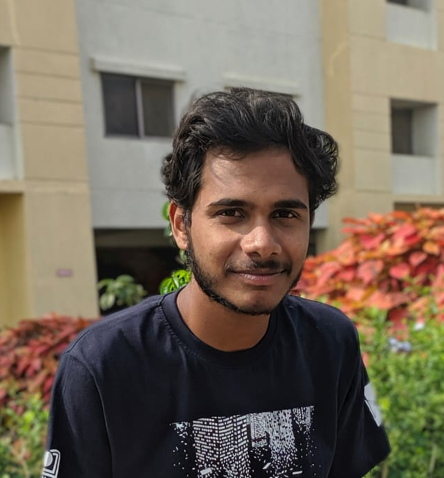

> This is your life and it's ending one minute at a time.
> 
 -Fight Club (1999) 

# About
***	

I am a 4th year BS MS student at the [Department of Earth and Climate Science](https://www.iiserpune.ac.in/research/departments/earth-and-climate-science) at [Indian Institute of Science Education and Research (IISER), Pune](https://www.iiserpune.ac.in/).	

My primary area of research interest is siesmic data analysis and full wave inversion. I have worked on the [Statistical Estimation of Seismic Source Signature](./research/source_signature/source_est.md) under the supervision of [Dr. Rahul Dehiya](https://www.iiserpune.ac.in/people/faculty-details/178), IISER Pune during Jan - Apr 2020. I have also worked breifly on 4D time lapse seismics. I am currently working on multichannel seismic data analysis and full wave inversion in frequency domain.

Find my cv [here](./cv.md)
