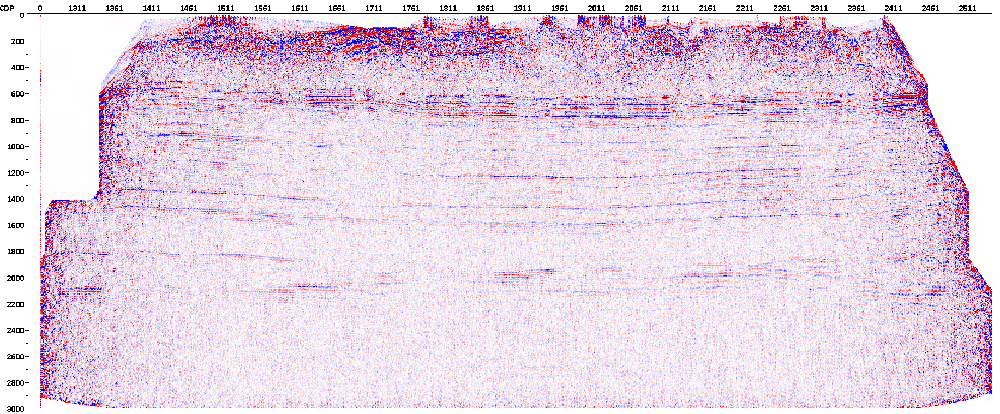
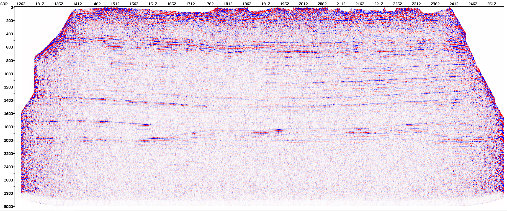

# Research
***

## Statistical Estimation of Seismic Source Signature

Seismic source signature estimation is an essential problem in exploration seismology. There are many ways to estimate the source signature. 
One of the most important methods of estimating source signaal is by deconvolution of the recorded response with the actual Earth’s response signature. 
In this project, I created an algorithm to estimate the source signature by Virtual-Real Source Method [Behura and Snieder, 2013] 
and made some modifications for only one single recorded sigal.

[space]*The estimated and the actual source signature.*

## Estimation and Execution of Time Shift in 4D Time Lapse Seismics

Time lapse seismics have created a breakthrough in the field of reservoir monitoring and to Enhanced Oil Recovery (EOR) methods. The one of the important procedure
is to match the monitor data with baseline data. In order to do so, the time shift has to be estimated. So I created an algorith to estimate the time shift between
monitor and baseline data by taylor series approximation and also I tried to execute the index variant time shift to monitor trace for matching it with the baseline.

<em> The baseline and monitor data and estimated time shift (Fig 1). Time shifted monitor and baseline data (Fif 2). </em>

## Multichannel Seismic Data Analaysis
Seismic data will provide us a time picture of subsurface structure. The data can be analysed to visualizing tools like imagery, models of velocity profiles, etc.
Exloration Geophysics Lab at IISER Pune undertook a 2D seismic survey (Refraction and Surface wave) of small area inside IISER Pune campus. Then we were able to process and analyse the data to get the velocity profile of the subsurface. P wave velocity was estimated by refraction data analysis and S wave by Multichannel Analysis of Surface Waves (MASW). 

<em> Velocity profile of subsurface from Refraction data analysis (Fig 1) and MASW (Fig 2). </em>

I have processed the open data [2D Vibroseis Line 001](https://wiki.seg.org/wiki/2D_Vibroseis_Line_001), using RadEXPro Seismic Software, with the motivation of 
familiarizing the processing steps and the underlying principles behind it.

<em> Brute stack. </em>

<em> Final Stack. </em>

   
