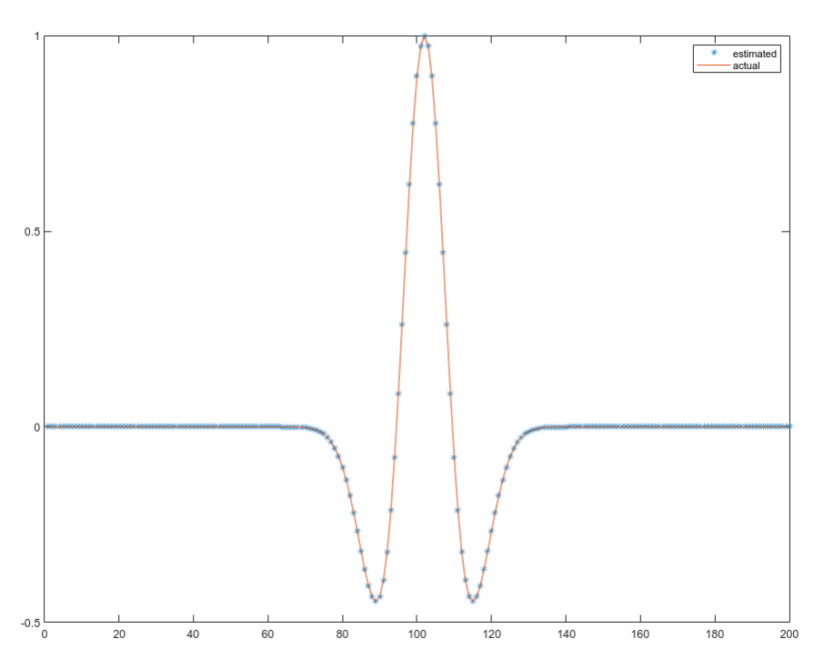

# Statistical Estimation of Seismic Source SIgnature
### under the supervision of Dr. Rahul Dehiya, IISER Pune

## Abstract
Seismic source signature estimation is an essential problem in exploration seismology. There are many ways to estimate the source signature. One of the most
important methods of estimating source signaal is by deconvolution of the recorded response with the actual Earth’s response signature. In this project, we aim to
create an algorithm to estimate the source signature by Behura’s method [Behura et al, 2013] and make some modifications.

  Result from synthetic data  
  

  

[back to home](/index.md)
